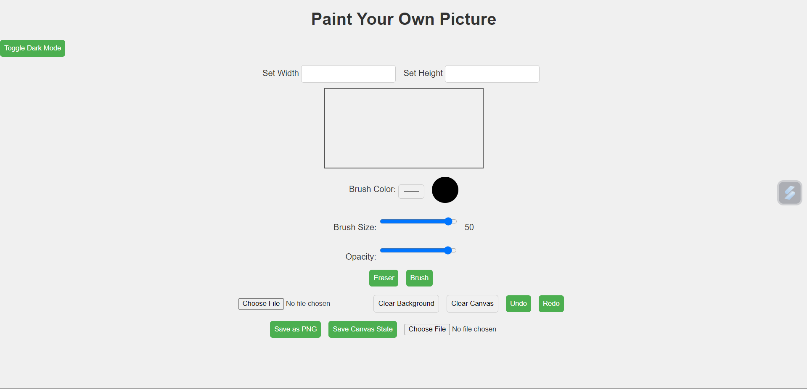

# Interactive Painter

Interactive Painter is a web-based drawing application that allows users to paint on a canvas, customize brush settings, toggle between dark and light modes, and upload custom backgrounds. The application is built using HTML, CSS, and JavaScript.

## Features

- **Dark Mode Toggle**: Switch between light and dark themes.
- **Customizable Canvas**: Adjust the canvas width and height.
- **Brush Settings**:
  - Change the brush color.
  - Adjust the brush size.
  - Set brush opacity.
  - Toggle between brush and eraser modes.
- **Undo/Redo**: Undo and redo your recent actions on the canvas.
- **Background Image Upload**: Upload and clear custom backgrounds for the canvas.
- **Save/Load Canvas**: Save the canvas as a PNG or JSON file, and load saved canvas states.
- **Responsive Design**: Optimized for different screen sizes.

## Installation

To run this project locally, follow these steps:

1. Clone the repository:
    ```bash
    git clone https://github.com/rahulvishwakarmax/Interactive-Painter.git
    ```

2. Navigate to the project directory:
    ```bash
    cd interactive-painter
    ```

3. Open the `index.html` file in your web browser:

    - **macOS**:
      ```bash
      open index.html
      ```
    - **Windows**:
      ```bash
      start index.html
      ```
    - **Linux**:
      ```bash
      xdg-open index.html
      ```

4. (Optional) To serve the project using a local server, you can use a simple HTTP server. For example, if you have Python installed, you can use the following command:

    - **Python 3**:
      ```bash
      python -m http.server
      ```
    - **Python 2**:
      ```bash
      python -m SimpleHTTPServer
      ```

    After running the server, open your browser and go to `http://localhost:8000` to view the project.


## Usage

- Open the application in your browser.
- Use the controls to customize your painting:
  - Set the canvas width and height.
  - Select a brush color, size, and opacity.
  - Toggle between brush and eraser modes.
  - Upload a background image or clear it.
  - Save or load canvas states.
  - Undo or redo your actions.

## Files

- **index.html**: The main HTML file that structures the web page.
- **styles.css**: The CSS file for styling and responsiveness.
- **script.js**: The JavaScript file that handles canvas interactions, brush settings, undo/redo functionality, and theme toggling.

## Technologies Used

- **HTML5**: For structuring the application.
- **CSS3**: For styling and responsive design.
- **JavaScript**: For interactive functionalities like canvas drawing, theme toggling, etc.

## Screenshots



## Future Enhancements

- Add additional brush styles like pencil or spray.
- Improve UI/UX with enhanced animations and smoother interactions.
- Implement advanced image editing features.

## License

This project is licensed under the MIT License - see the [LICENSE](LICENSE) file for details.
